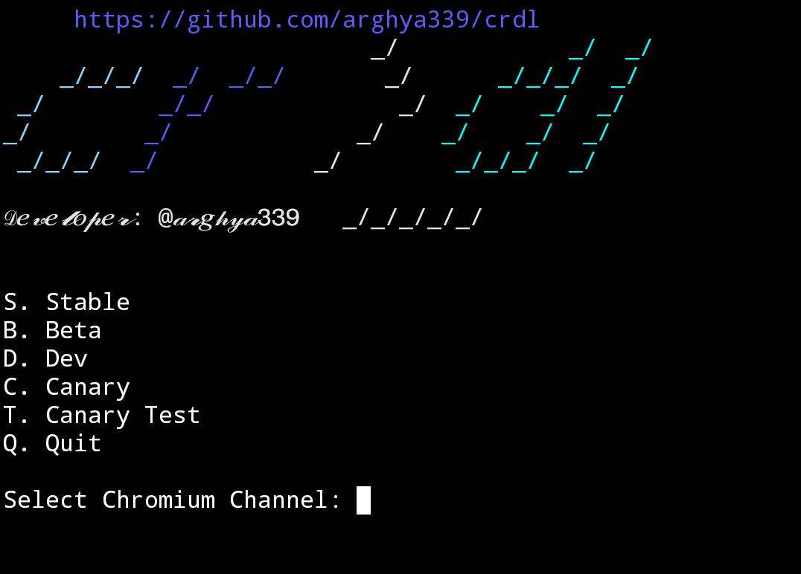
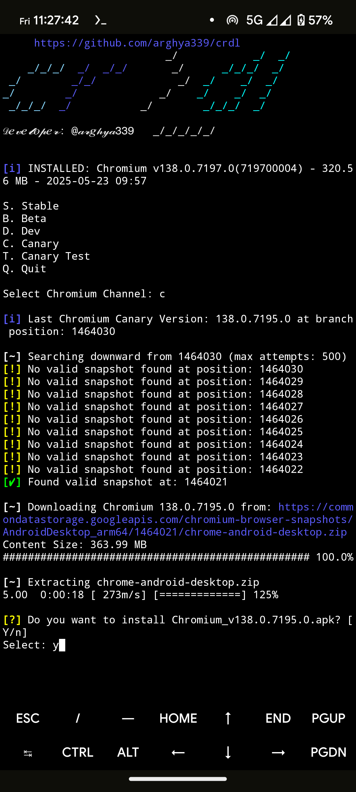
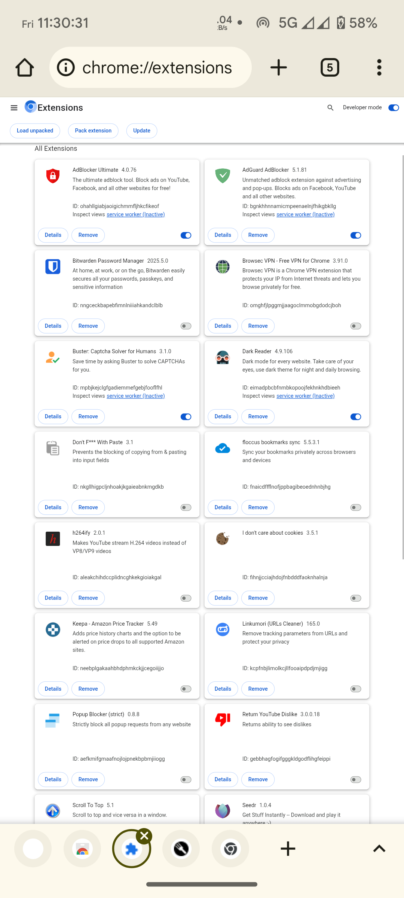
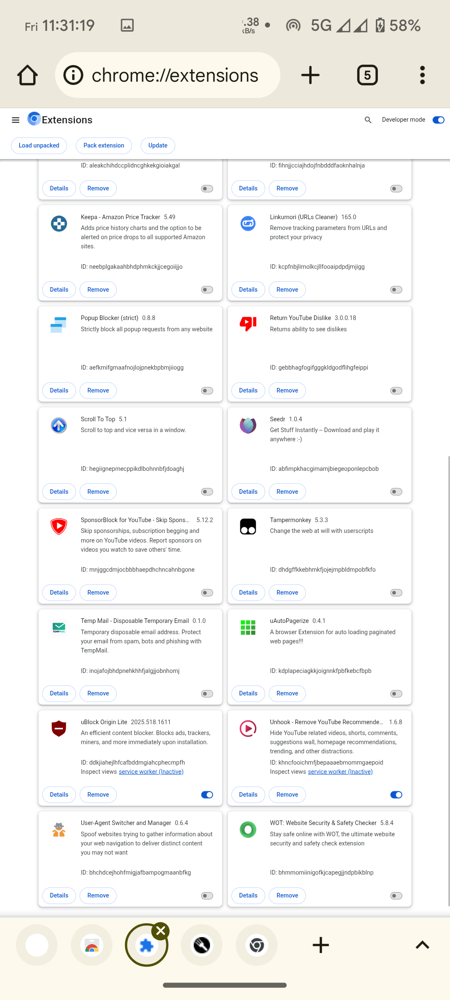

<h1 align="center">cr >_dl</h1>
<p align="center">
A feature-rich command-line Chromium Downloader for Android/ macOS/ Windows.
<br>
<br>

<br>

## Purpose
- This script automates the process of downloading Chromium using shell script.

## Feature
- Downloads the latest version of Chromium.
- written in bash shell script.
- Custom channel support (e.g. extended, stable, beta, dev, canary, last canary).
- Support macOS 10+ and Android 10+ (arm64-v8a, armeabi-v7a, x86_64) and Windows 10+.
- Also support Android 9-8 (arm64-v8a, armeabi-v7a, x86_64) and Android 7 (arm64-v8a, armeabi-v7a) and Android 6-5 (armeabi-v7a).
- AndroidDesktopChromium (arm64, x64) [Extensions](https://chromewebstore.google.com/category/extensions) support
- Built in Updating Checks feature.
- Support auto resuming Chromium downloads
- [aria2](https://github.com/aria2/aria2) as default downloader for Canary Test dl instead of [curl](https://github.com/curl/curl)
- Auto Delete the downloaded file after installation complete.
- Support SU (ROOT: [Magisk](https://github.com/topjohnwu/Magisk)) and [SUI](https://github.com/RikkaApps/Sui) ([Shizuku](https://github.com/RikkaApps/Shizuku)) Installer method.
- Fallback to Session installer if SU / SUI installer not present.
- Prefer 32-bit apk if device is usually low on memory (lessthen 4GB RAM).
- User Friendly, Free and Open Source.
- Smaller size script (< 30 KB), allowing you to save space on your device.

## Prerequisites
- macOS computer with working internet connection.
- Android device with working internet connection.
- Android device with root access (optional).
- Windows 10 1809 (build 17763) or later (Windows 11) with working internet connection.

## Usage
### Android
  - Open [Termux](https://github.com/termux/termux-app/releases/) and type following command then press `Enter` key twice:
  ```sh
  pkg update && pkg install --only-upgrade apt bash -y
  ```
  run the script with the following command:
  ```sh
  curl --progress-bar -o "$HOME/.crdl.sh" https://raw.githubusercontent.com/arghya339/crdl/main/Termux/crdl.sh && bash "$HOME/.crdl.sh"
  ```
  Run crdl with these commands in Termux:
  ```
  crdl
  ```
> [!NOTE]
> This script was tested on an arm64-v8a device running Android 14 with Termux v0.118.2 with bash v5.2.37(1).

### Android 9~5
  - Open [Termux](https://github.com/termux/termux-app/releases/) and type following command then press `Enter` key twice:
  ```sh
  pkg update && pkg install --only-upgrade apt bash -y
  ```
  run the script with the following command:
  ```sh
  curl --progress-bar -o "$HOME/.crdl.sh" https://raw.githubusercontent.com/arghya339/crdl/main/Termux/odcrdl.sh && bash "$HOME/.crdl.sh"
  ```

### macOS
  - Open macOS Terminal and run the script with the following command:
  ```sh
  curl --progress-bar -o "$HOME/.crdl.sh" https://raw.githubusercontent.com/arghya339/crdl/main/Terminal/crdl.sh && bash "$HOME/.crdl.sh"
  ```
  Run crdl with these commands in Terminal:
  ```
  crdl
  ```
> [!NOTE]
> This script was tested on an Intel Mac running macOS Sonoma (14) with Terminal v2.14(453) with bash v3.2.57.

### Windows
  - Open Windows Terminal (Admin) / Microsoft PowerShell (Admin) and run the script with the following command:

  ```pwsh
  Invoke-WebRequest -Uri "https://raw.githubusercontent.com/arghya339/crdl/refs/heads/main/PowerShell/crdl.ps1" -OutFile "$env:USERPROFILE\.crdl.ps1"; Set-ExecutionPolicy Bypass -Scope Process -Force; & "$env:USERPROFILE\.crdl.ps1"
  ```
  Run crdl with these commands in Windows PowerShell (Admin):
  ```pwsh
  Set-ExecutionPolicy Bypass -Scope Process -Force; & "$env:USERPROFILE\.crdl.ps1"
  ```
  Run crdl with these commands in Microsoft PowerShell (Admin):
  ```
  & .crdl.ps1
  ```
> [!NOTE]  
> This script was tested on an x86_64 (AMD64) PC running Windows 11 Pro with both Windows PowerShell v5.1.26100.2161 and Microsoft PowerShell v7.5.0

### Linux
- [Flathub](https://flathub.org/setup) - [Chromium](https://flathub.org/apps/org.chromium.Chromium)

## Chromium update notification
### Android
  - [Feeder](https://github.com/spacecowboy/Feeder/releases) + [rss/feed/android](https://chromium.woolyss.com/feed/android)
### macOS
  - [NetNewsWire](https://github.com/Ranchero-Software/NetNewsWire) + [rss/feed/mac](https://chromium.woolyss.com/feed/mac)
### Windows
  - [fluent-reader](https://github.com/yang991178/fluent-reader/releases) + [rss/feed/windows-64-bit](https://chromium.woolyss.com/feed/windows-64-bit) / [rss/feed/windows-32-bit](https://chromium.woolyss.com/feed/windows-32-bit)

## How it works (_[Demo on YouTube](https://youtube.com/)_)



## Install Extensions from Chrome Web Store on AndroidDesktop Mobile
### Prerequisites
  - AndroidDesktop Chromium 140.0.7280.0+

### Configure Browser Desktop Site Settings
  - Open **Chromium** browser.
  - Tap the three vertical dots **More** icon (⋮) in the top-right corner of Chromium.
  - Select **Settings** from the Chromium menu.
  - Scroll down and tap on **Site settings**.
  - Tap on **Desktop site**.
    - Select **Request Mobile view** options.
    - Tap on **Add site exception**.
    - **Site URL**: 
      ```
      https://chromewebstore.google.com/
      ```
    - Uncheked **Include all sites under this domain**
    - **Add**
    > (optional)
    - Select **Request Desktop view** options.
    - Make sure **When the window is narrow, request mobile view** is checked.

### Enable Device Auto-Rotate (optional)
  - Open device **Settings**.
  - Navigate to **Display** to find **Auto-rotate screen**.
  > [!NOTE] 
  > Exact location may vary by Android OEM & version.
  - or, Turn on **Auto-rotate** or Turn off **Rotation-lock** from device control center.

### Install Chrome Extension from Chrome Web Store
  - Open **Chromium** browser.
  - Go to the **[Chrome Web Store](https://chromewebstore.google.com/)** page for the extension you want to install.
  - **Rotate your mobile device to landscape mode** (optional). 
    > This action should trigger the browser to display the desktop version of the Chrome Web Store page.
    - Pull to Refresh or Tap the three-dot **More** icon (⋮) in the top-right corner of Chromium. Tap the refresh icon (🔄) at the top of that menu.
  - Once the page loads in desktop view, you will see the **Add to Chrome** button. Tap it to install the extension.

## Managing Extensions (Update)
### Access the Extensions Page
  - Open **Chromium** browser.
  - In the address bar, type **[chrome://extensions](chrome://extensions)** and press **Enter**.

### Update Extensions
  - On the **[chrome://extensions](chrome://extensions)** page, look for the **Developer mode** toggle in the top-right corner. **Enable Developer mode** if it's not already on.
  - Once **Developer mode** is enabled, you will see an **`Update`** button near the top.
  - Tap the **Update** button to check for and install updates for all your installed extensions.





## Disclaimer
- Chromium is an open-source browser project, developed and maintained by Google.

## Devoloper info
- Powered by [Chromium](https://github.com/chromium/chromium)
- Inspired by [chromium-latest-linux](https://github.com/scheib/chromium-latest-linux)
- Developer: [@arghya339](https://github.com/arghya339)

## Keep cruising the web!